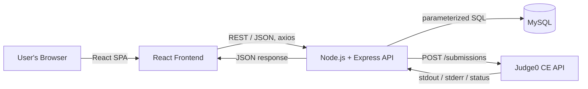
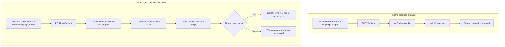

<p align="center">
  
</p>

<h1 align="center">DailyCode</h1>
<p align="center"><em>An online coding practice platform — levels, an in-browser code editor, auto-graded submissions, and an admin panel.</em></p>

---

## 1. Overview

DailyCode lets a learner work through a sequence of coding **levels**. For each level they can:

- **Run** their code against custom input (just to see output — doesn't affect progress)
- **Submit** their code — it's checked against that level's stored test cases, and the next level unlocks only if every test case passes

An **admin panel** lets staff manage users, levels/problems, feedback, and view a leaderboard and recent activity.

## 2. Tech stack

| Layer | Technology |
|---|---|
| Frontend | React (Create React App), React Router v7, Axios, Framer Motion, Monaco Editor |
| Backend | Node.js, Express 5 (ES modules) |
| Database | MySQL (via `mysql2`, raw parameterized SQL — no ORM) |
| Auth | bcrypt (password hashing) + JWT (`jsonwebtoken`) |
| Code execution | [Judge0 CE](https://ce.judge0.com) (external API) |
| Hosting | Frontend → Netlify · Backend → Render |

## 3. Architecture



The frontend **never** calls Judge0 directly — every code execution goes `Frontend → Backend → Judge0 → Backend → Frontend`. This keeps the Judge0 endpoint and any execution logic server-side only.

### Run vs. Submit



A submit for a level that isn't the user's actual frontier level (e.g. reviewing an already-passed earlier level) never advances progress — only passing the user's **current** level does.

## 4. Project structure

```
reactfolder/
├── backend/
│   ├── server.js                  # Express app, route mounting, CORS, startup DB check
│   ├── db.js                      # mysql2 connection pool
│   ├── controllers/
│   │   ├── auth.controller.js     # signup / login (bcrypt + JWT)
│   │   ├── code.controller.js     # getLevels, getLevel, runCode, submitCode
│   │   └── admin.controller.js    # create level + test cases
│   └── routes/
│       ├── auth.routes.js
│       ├── code.routes.js         # /levels/:userId, /level/:userId, /run, /submit
│       ├── contact.routes.js
│       └── adminRoutes/
│           ├── admin.routes.js        # create level
│           ├── dashboard.routes.js    # /counts, /recent-submissions
│           ├── users.routes.js
│           ├── problems.routes.js
│           ├── submissions.routes.js
│           ├── feedback.routes.js
│           └── leaderboard.routes.js
│
└── frontend/
    └── src/
        ├── api.jsx                      # single axios instance (backend base URL)
        ├── App.js                       # route definitions
        ├── AdminDashboard.jsx           # admin shell: topbar + sidebar
        ├── AdminPannel/
        │   ├── theme.js                 # design tokens (colors, type, spacing)
        │   ├── icons.jsx                 # inline SVG icon set
        │   ├── ui.jsx                    # shared primitives (StatCard, Badge, EmptyState…)
        │   ├── Dashboard.jsx             # admin Overview page
        │   └── AddLevelWithTestCases.jsx # create-level form
        ├── pages/
        │   ├── Users.jsx
        │   ├── Problems.jsx
        │   ├── Feedback.jsx
        │   ├── Leaderboard.jsx
        │   └── userDash.jsx              # learner's own dashboard
        └── components/
            ├── Navbar.jsx                # top nav + profile dropdown
            ├── login.jsx                 # login/signup form
            ├── ProtectedRoute.jsx        # role-gated route wrapper
            ├── Code_editor.jsx           # Run/Submit UI (wraps CodeEditor.jsx)
            └── CodeEditor.jsx            # Monaco editor wrapper
```

## 5. Database schema

MySQL, relational, no ORM. Core tables:

| Table | Purpose | Key columns |
|---|---|---|
| `users` | Accounts | `user_id` (PK), `name`, `email`, `password` (bcrypt hash), `role` (`user` \| `admin`) |
| `levels` | Coding problems | `id` (PK), `level_no`, `title`, `description`, `difficulty`, `youtube_link` |
| `test_cases` | Test cases per level — **one row per test case**, not a delimited column | `id` (PK), `level_id` (FK → `levels.id`), `input_data`, `expected_output` |
| `user_progress` | Per-user frontier level | `user_id` (FK → `users.user_id`), `current_level` |
| `feedback` | Contact-form messages | `id`, `user_id` (nullable FK), `email`, `message`, `created_at` |
| `submissions` | Log of every run/submit attempt, powers the admin activity feed | `id`, `user_id`, `level_id`, `language`, `status`, `created_at` |

Test cases are deliberately normalized into their own table (rather than one column holding multiple delimited values) so a level can have any number of test cases without a schema change or `split()`-based parsing in the backend.

## 6. API reference

All routes are prefixed with `/api`.

| Method | Path | Auth required* | Purpose |
|---|---|---|---|
| POST | `/auth/signup` | – | Create account, hash password, default `role = 'user'` |
| POST | `/auth/login` | – | Verify credentials, issue JWT |
| GET | `/levels/:userId` | – | List levels + lock state for a user |
| GET | `/level/:userId?level=` | – | Fetch one level (defaults to the user's current level) |
| POST | `/run` | – | Execute code with user-supplied input via Judge0 |
| POST | `/submit` | – | Run all of a level's test cases; advance progress if all pass |
| POST | `/contact` | – | Store a feedback/contact message |
| POST | `/admin/level` | – | Create a level with its test cases |
| GET | `/dashboard/counts` | – | Users / problems / feedback / leaderboard totals |
| GET | `/dashboard/recent-submissions` | – | Last 5 submissions for the Overview activity feed |
| GET | `/users` | – | List all users |
| GET | `/problems` | – | List levels with difficulty + test case count |
| DELETE | `/problems/:id` | – | Delete a level |
| GET | `/submissions` | – | Full submission history |
| GET | `/feedback` | – | All feedback messages |
| GET | `/leaderboard` | – | Users ranked by `current_level` |

\* **Honest caveat:** a JWT is issued at login and stored client-side, and the React app's `ProtectedRoute` uses it to gate which *pages* render. The Express backend does not currently run a `jwt.verify` middleware on any route — authorization today is UI-level only, not enforced at the API layer. See [Known limitations](#8-known-limitations--roadmap).

## 7. Authentication flow

1. **Signup** — password hashed with `bcrypt`; user row inserted with `role = 'user'`.
2. **Login** — password compared against the hash; on success, a JWT (`jsonwebtoken`, signed with `process.env.JWT_SECRET`) is issued containing the user's id and role.
3. **Frontend** stores `token`, `userId`, `name`, `email`, `role` in `localStorage`.
4. **`ProtectedRoute`** reads `role` from `localStorage` on every route render and redirects unauthorized users.
5. **Persistence** — because this all reads from `localStorage` rather than in-memory state, login survives a full page refresh with no extra code needed.
6. **Logout** clears `localStorage` and redirects to `/login`.

## 8. Known limitations / roadmap

- **No server-side JWT verification** — add `authMiddleware` / `adminMiddleware` to the Express routes so the API itself enforces auth, not just the UI.
- **No automated tests** — a test suite (Jest/Supertest for the API, React Testing Library for the frontend) would catch regressions like endpoint/field-name mismatches before deploy.
- **No rate limiting or request validation layer** — e.g. `express-rate-limit` on `/auth/login` and `/submit`, and schema validation (Zod/Joi) instead of per-controller manual checks.
- **Runtime schema self-healing instead of migrations** — `submissions` table creation/column patching currently happens at request time (`CREATE TABLE IF NOT EXISTS` + `ALTER TABLE ADD COLUMN`) as a pragmatic fix; a proper migration tool (e.g. `knex` migrations) would be more maintainable long-term.
- **Unused dependency** — `mongoose` is listed in the backend's `package.json` but this project is 100% MySQL; safe to remove.

## 9. Local setup

### Backend

```bash
cd backend
npm install
cp .env.example .env   # fill in DB_HOST, DB_USER, DB_PASSWORD, DB_NAME, JWT_SECRET, PORT
npm start
```

### Frontend

```bash
cd frontend
npm install
npm start               # runs on http://localhost:3000
```

Update `src/api.jsx`'s `baseURL` to point at your local backend (e.g. `http://localhost:5000/api`) for local development.

## 10. Deployment

| Service | Host | Notes |
|---|---|---|
| Frontend | Netlify | Static build via `react-scripts build`; CRA's `"proxy"` field only affects local dev, not the production build |
| Backend | Render | Node web service; config via environment variables, not hardcoded secrets |

CORS on the backend is explicitly restricted to the known frontend origins (`server.js`) rather than left open.
